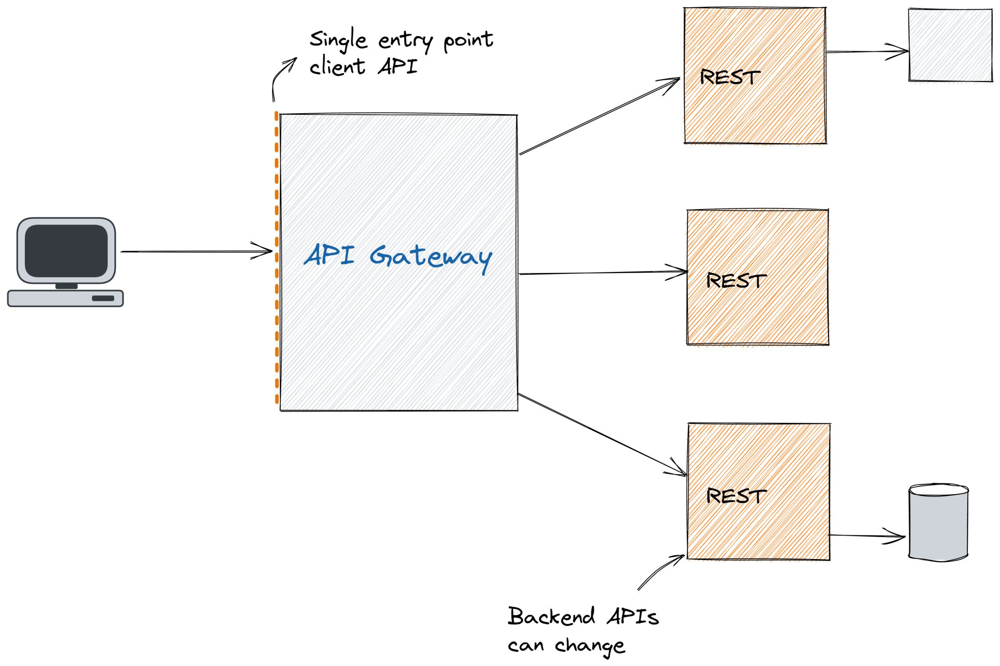

O que é um api gateway?

Uma ferramenta de gerenciamento de API conhecida como api gateway fica entre um cliente e um grupo de serviços de back-end. Ele desempenha a função de um proxy reverso aceitando todas as chamadas da interface de programação de aplicativos (API), agregando os diferentes serviços necessários para atendê-las e retornando o resultado correto.

Ao usar gateways de API, a maioria das APIs corporativas é implantada. Usuário authentication, rate limits, e statistics são deveres comuns que os gateways de API cuidam em nome de um sistema de serviços de API.

Um serviço de API recebe uma solicitação remota e responde a ela. Mas, na realidade, nada é tão fácil. Ao hospedar APIs de grande escala, leve em consideração vários pontos:

* Usar rate limit e serviços de autenticação para proteger suas APIs contra abuso e uso excessivo.

* Implementar anallytics e ferramentas de monitoramento porque você quer saber como as pessoas usam suas APIs.

* Você deve vincular a um sistema de pagamentos se suas APIs forem monetizadas.
* Se você escolheu uma arquitetura de microserviços, um único pedido pode precisar chamar centenas de programas diferentes.
* Seus clientes ainda vão querer poder acessar todos os seus serviços em um único endpoint mesmo quando você adicionar novos serviços de API ao longo do tempo e aposentar outros.

Então, como funciona em geral:

1. O gateway de API recebe uma solicitação HTTP de um cliente.
2. Quando recebido, valida primeiro o pedido.
3. O gateway de API verifica com um provedor de identidade sobre autenticação/autorização.
4. As regras de limitação de taxa são então aplicadas à solicitação.
5. Em seguida, o gateway de API encontra os serviços de back-end e roteia a solicitação.

Também para isso, o gateway da API pode gerenciar falhas (circuit breaker),  logging, caching e monitoramento.

Alguns api gateways:

* Apigee
* Express Gateway
* Tyk API Gateway 
* Kong 
* Traefik

Os principais provedores de nuvem pública oferecem ferramentas de gateway de API específicas para suas plataformas: Amazon API Gateway, Azure API Gateway e Google Cloud API Gateway.

